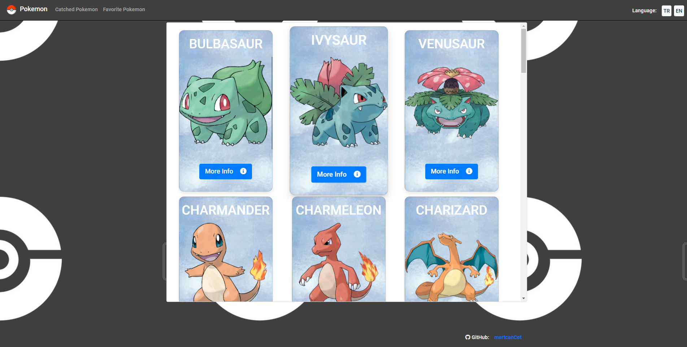

<br />
<p align="center">

  <h1 align="center">Pokemon App</h1>

</p>

I created a simple Pokédex application using Poke API and React.

Demo link: https://confident-babbage-9d4b30.netlify.app/


## Screens



 #### Details Screen
 

<div>
  
 #### Catched and Fav Pokemons
 


</div>

### Features:

- List pokémons using the API
- Show pokémon details
- Catch pokémons and keep the déx record in Redux
- Release pokémons
- List caught pokémons
- Pagination
- Add/remove favorite caught pokémons
- Language support
- Responsive design

### Built With

- [React](https://reactjs.org/)
- [Redux](https://redux.js.org/)
- [React-Router](https://reactrouter.com/)
- [Axios](https://www.npmjs.com/package/axios)
- [Bootstrap](https://getbootstrap.com)

This project was bootstrapped with [Create React App](https://github.com/facebook/create-react-app).

### Installation & Run

```sh
 git clone https://github.com/mertcancet/pokemonApp
 cd pokemonApp
 npm install
 npm run start
```

Runs the app in the development mode.
Open http://localhost:3000 to view it in the browser.
